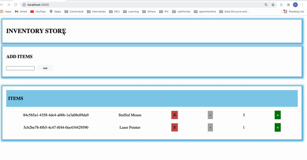
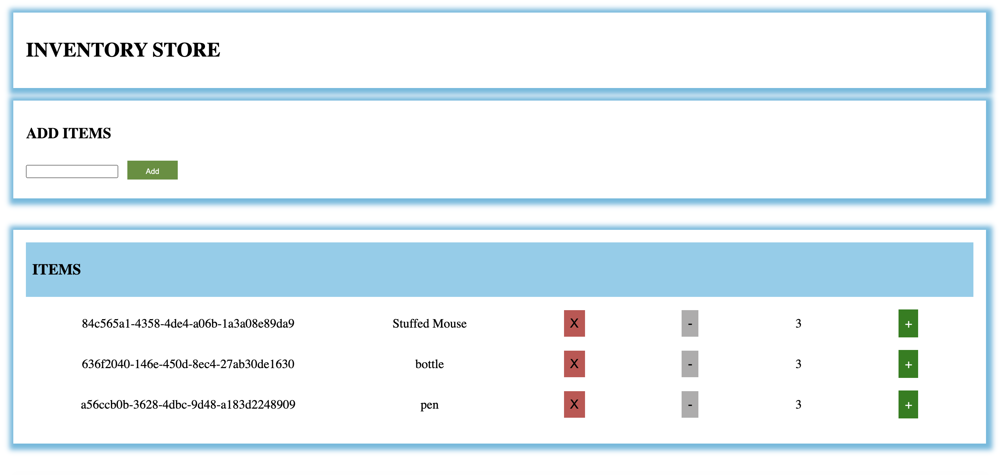

# INVENTORY STORE

## Project Description
* Single Page Application for Managing Inventory
* Tech Stack: HTML, CSS, REACT, Node, Express
* Application provides below features
    1. Adding /Deleting items in Inventory
    2. Increasing/Decreasing quantity of inventory items
* Built REST API's POST/DELETE/PUT for creating,deleting,updating inventory items
* For detailed description read ```InventoryManagement/README.md```

## How to run Inventory Store
* Clone the repository ```https://github.com/dj0894/InventoryStore.git```
* Navigate to root folder ```/InventoryStore/```
* Run command ```npm install``` to install dependencies
* Run command ```node server.js``` to run the application. Application will start running at ```http://localhost:3000/```

## Demo
 For full demo [click here](https://drive.google.com/drive/u/0/folders/111ZBqSCnZ2QWN0FtnDhR8udxgrfTYf5e)
 

## Screenshots



